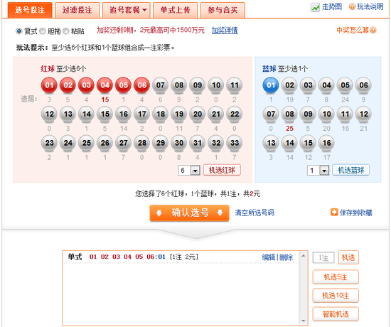
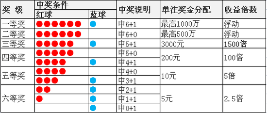

# LotteryTicket

> C Sharp 期末项目双色球

Author(作者) : susmote

> 未经授权不可随意传播，建议自己写，用双手成就你们的梦想

  

 <br>

[TOC]

<br>

项目目录说明:airplane:

- LotteryTicket  :  双色球项目本地win10系统版（加了很多修饰）
  - Program.cs  :  主程序文件
  - init_window.cs  :  初始化窗口类
  - luckfunc.cs  :  主要功能的类
- LotteryTicket_easy  :  双色球项目机房win7版（适用于vs2010），完成了基本功能，相比:point_up:的项目简单了很多
  - Program.cs  :  主程序文件
  - init_window.cs  :  初始化窗口类
  - luckfunc.cs  :  主要功能的类
- images    : 说明文档中的图片

<br>

### 一.项目配置条件:

- Project_Name（项目名称） : 	LotteryTicket
- Framework（运行框架）      :     .NETFramework Version = v4.7.2
- IDE（集成开发环境）            :      Jetbrains Rider
- Main  System（操作系统）  :     Windows 10


<br>

<br>

### 二.双色球规则

<br>

1.“双色球”每注投注号码由6个红色球号码和1个蓝色球号码组成。红色球号码从1—33中选择；蓝色球号码从1—16中选择。每注金额人民币2元。 

2.单式投注，由购买者从01-33共33个红色号码球中选择6个号码，并从01-16共16个蓝色号码球中选择1个号码，组合为一注投注号码的基本投注。

    

3.中奖规则如图




<br><br>

### 三.程序特点

##### 1.使用var关键字

> var 是3.5新出的一个定义变量的类型，其实也就是弱化类型的定义，var可代替任何类型，编译器会根据上下文来判断你到底是想用什么类型的 

<br>

使用var定义变量时有以下四个特点： 

1. 必须在定义时初始化。也就是必须是`var s = “abcd”`形式，而不能是如下形式： 

```c#
var s;
s = “abcd”;
```

2. 一但初始化完成，就不能再给变量赋与初始化值类型不同的值了。 
3. var要求是局部变量。 
4.  使用var定义变量和object不同，它在效率上和使用强类型方式定义变量完全一样。 

<br>

var关键字是C# 3.5开始新增的特性，称为推断类型 . 可以赋予局部变量推断“类型”var 而不是显式类型。var 关键字指示编译器根据初始化语句右侧的表达式推断变量的类型。推断类型可以是内置类型、匿名类型、用户定义类型、.NET Framework 类库中定义的类型或任何表达式。 

<br>

在我的程序中为了适应新特性就大量使用了var关键字，最主要还是被编辑器要求的，例如我的这些代码

```c#
var tem_blue_ball = new int[16];	//申明一个int数组对象
var blue_ball = new string[16];		//申明一个字符串数组对象
var res_blue_ball = "01";		//申明一个字符串对象
var random = new Random();		//申明一个Randow对象，用于产生随机数
var index = random.Next(blue_ball.Length);		//将产生的随机数赋值给变量
```

<br>

##### 2.封装类与方法

> 在程序的编写中，我避免了使用面向过程的方法，为了使程序具有可重用性，我使用的面向对象的方法，对每个方法都进行了封装

<br>

### 四.功能实例

##### 1.生成随机双色球

> 生成随机双色球当然少不了random对象的使用

###### ①生成红色随机随机数字

​	在生成红色随机数字时，我先定义了一个用来存储所有的从1-33的数字的`int`类型的数组，因为要实现输出01、02类似的数字，我又通过对象的`ToString`方法对每一个元素进行了格式化，最后得到了一个存储"01"、"02" ...、"32"、"33"的字符串数组，也就是所有的红色号码球，下面是部分代码:

```c#
var tem_red_ball = new int[33];
var red_ball = new string[33];
var res_red_ball = new string[6];
for (var i = 1; i <= tem_red_ball.Length; i++)
{
    tem_red_ball[i - 1] = i;
    var sig_redball = tem_red_ball[i - 1].ToString("D2");
    red_ball[i - 1] = sig_redball;
}
```

​	为了防止重复数字出现，我又定义了一个`bool`类型的数组，数组大小也就是整个红球的数量，从01到33，如果这个号码已经被选了，那么这个`bool`数组指定号码的位置就被标为`true`，然后，下面就是随机数字的生成，实例化一个随机对象，然后通过随机对象的`Next`方法,生成01到33的随机数，然后把它存到一个大小为6的数组中，最终作为变量返回即可。在这里我使用了一个while循环

```C#
while(true)
{
    var index = random.Next(red_ball.Length);  
    if(used_number[index])  
        continue ;
    res_red_ball[length++] = red_ball[index];
    used_number[index] = true ;
    if(length == res_red_ball.Length) 
        break ;
}
```

<br>

###### ②.生成蓝色随机数字

> 生成蓝色随机数字球比较简单，一个简单的随机生成即可

为了达到和红色一样有01、02...的效果，我在这还是通过代码生成 了一个大小为16的字符串数组，然后通过随机生成索引最终获得了这个随机数，关键代码如下

```C#
var random = new Random();
var index = random.Next(blue_ball.Length);
res_blue_ball = blue_ball[index];
```

